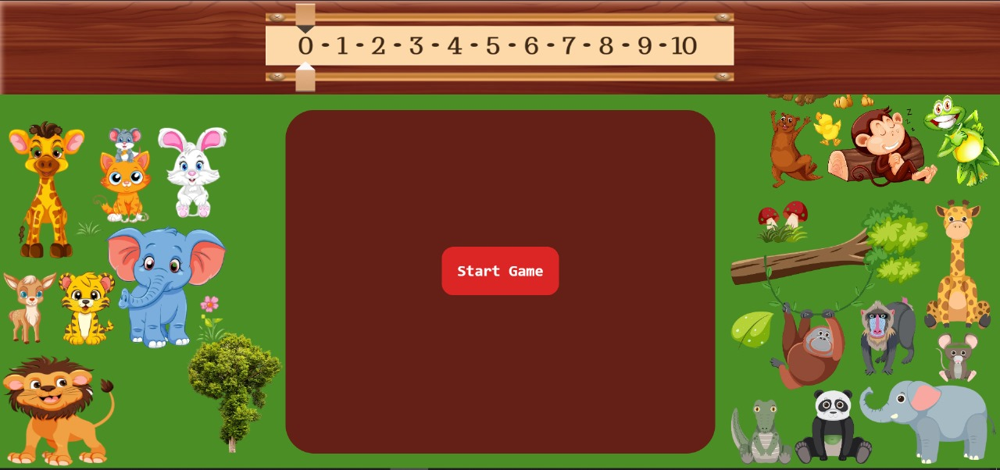

# Memory Game

This project is a fun and interactive memory game built with HTML, CSS, and JavaScript. The game involves flipping cards to find matching pairs. It features sound effects, animations, and a timer.



## Features

- Flip cards to find matching pairs
- Timer to keep track of game duration
- Score tracking with a sliding score indicator
- Sound effects for matched and unmatched pairs
- Confetti animation on winning
- Responsive design with animations

## Getting Started

Follow these instructions to get a copy of the project up and running on your local machine for development and testing purposes.

### Prerequisites

- A modern web browser (Google Chrome, Firefox, etc.)
- A local web server for serving static files (optional, but recommended for best performance)

### Installation

1. **Clone the repository:**

    ```bash
    git clone https://github.com/Mohda24/Memory-game.git
    cd Memory-game
    ```

2. **Open the project:**

    - Open `index.html` in your web browser to start the game.

    Or, if you are using a local web server:

    - Start your web server and navigate to the project directory.
    - Open your web browser and go to `http://localhost:YOUR_PORT/index.html`.

## Usage

1. **Start the Game:**

    - Click the "Start Game" button to begin.

2. **Flip Cards:**

    - Click on any card to flip it.
    - Try to find matching pairs of cards.
    - If the cards match, they will remain flipped.
    - If the cards do not match, they will flip back after a short delay.

3. **Win the Game:**

    - The game is won when all pairs are matched.
    - Upon winning, a congratulatory message and the total time taken will be displayed.
    - Confetti animation will start and the winning sound will play.

4. **View Rules:**

    - Click the "Rules" button to view the game rules.
    - Click the close icon to hide the rules.

5. **Restart the Game:**

    - Click the "Restart Game" button to restart the game.

## Code Overview

### HTML

The `index.html` file contains the structure of the game, including the header, main game area, and rules section.

### CSS

The `style.css` file contains the styles for the game, including layout, colors, fonts, and animations.

### JavaScript

The `script.js` file contains the game logic, including:

- Event listeners for starting the game, flipping cards, checking for matches, and displaying the rules.
- Functions for managing the timer, score, and game states.
- Audio elements for sound effects.
- Confetti animation on winning.

### Libraries and Assets

- [AOS (Animate On Scroll)](https://michalsnik.github.io/aos/) for scroll animations.
- [js-confetti](https://github.com/loonywizard/js-confetti) for confetti animations.
- Custom images and sounds stored in the `img` and `audio` directories, respectively.

## Contributing

If you would like to contribute to this project, please fork the repository and create a pull request with your changes. Contributions, issues, and feature requests are welcome.

## License

This project is licensed under the MIT License. See the [LICENSE](LICENSE) file for details.

## Acknowledgments

- [AOS (Animate On Scroll)](https://michalsnik.github.io/aos/) library for scroll animations.
- [js-confetti](https://github.com/loonywizard/js-confetti) library for confetti animations.
- Various online resources and tutorials for inspiration and guidance.

---

Created by Ouzed Mhamed

Enjoy the game! 🎉😎
